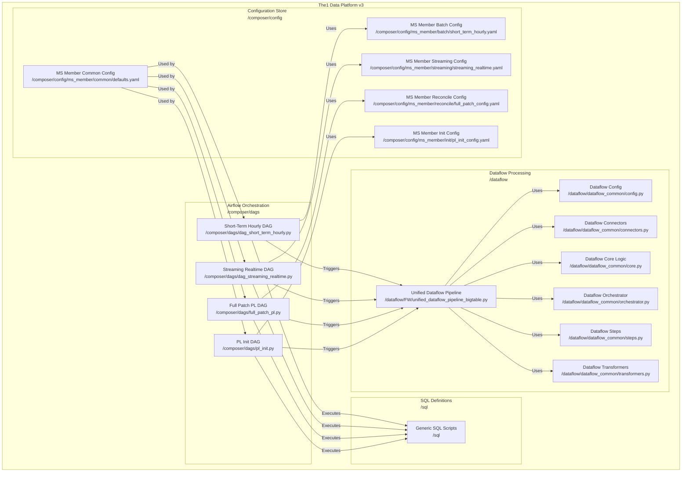

# Unnamed CodeViz Diagram

```mermaid
graph TD

    subgraph the1_data_platform["The1 Data Platform v3<br>[External]"]
        subgraph airflow_orchestration["Airflow Orchestration<br>/composer/dags"]
            short_term_hourly_dag["Short-Term Hourly DAG<br>/composer/dags/dag_short_term_hourly.py"]
            streaming_realtime_dag["Streaming Realtime DAG<br>/composer/dags/dag_streaming_realtime.py"]
            full_patch_pl_dag["Full Patch PL DAG<br>/composer/dags/full_patch_pl.py"]
            pl_init_dag["PL Init DAG<br>/composer/dags/pl_init.py"]
        end
        subgraph dataflow_processing["Dataflow Processing<br>/dataflow"]
            unified_pipeline["Unified Dataflow Pipeline<br>/dataflow/FW/unified_dataflow_pipeline_bigtable.py"]
            dataflow_config["Dataflow Config<br>/dataflow/dataflow_common/config.py"]
            dataflow_connectors["Dataflow Connectors<br>/dataflow/dataflow_common/connectors.py"]
            dataflow_core["Dataflow Core Logic<br>/dataflow/dataflow_common/core.py"]
            dataflow_orchestrator["Dataflow Orchestrator<br>/dataflow/dataflow_common/orchestrator.py"]
            dataflow_steps["Dataflow Steps<br>/dataflow/dataflow_common/steps.py"]
            dataflow_transformers["Dataflow Transformers<br>/dataflow/dataflow_common/transformers.py"]
            %% Edges at this level (grouped by source)
            unified_pipeline["Unified Dataflow Pipeline<br>/dataflow/FW/unified_dataflow_pipeline_bigtable.py"] -->|"Uses"| dataflow_config["Dataflow Config<br>/dataflow/dataflow_common/config.py"]
            unified_pipeline["Unified Dataflow Pipeline<br>/dataflow/FW/unified_dataflow_pipeline_bigtable.py"] -->|"Uses"| dataflow_connectors["Dataflow Connectors<br>/dataflow/dataflow_common/connectors.py"]
            unified_pipeline["Unified Dataflow Pipeline<br>/dataflow/FW/unified_dataflow_pipeline_bigtable.py"] -->|"Uses"| dataflow_core["Dataflow Core Logic<br>/dataflow/dataflow_common/core.py"]
            unified_pipeline["Unified Dataflow Pipeline<br>/dataflow/FW/unified_dataflow_pipeline_bigtable.py"] -->|"Uses"| dataflow_orchestrator["Dataflow Orchestrator<br>/dataflow/dataflow_common/orchestrator.py"]
            unified_pipeline["Unified Dataflow Pipeline<br>/dataflow/FW/unified_dataflow_pipeline_bigtable.py"] -->|"Uses"| dataflow_steps["Dataflow Steps<br>/dataflow/dataflow_common/steps.py"]
            unified_pipeline["Unified Dataflow Pipeline<br>/dataflow/FW/unified_dataflow_pipeline_bigtable.py"] -->|"Uses"| dataflow_transformers["Dataflow Transformers<br>/dataflow/dataflow_common/transformers.py"]
        end
        subgraph sql_definitions["SQL Definitions<br>/sql"]
            generic_sql_scripts["Generic SQL Scripts<br>/sql"]
        end
        subgraph configuration_store["Configuration Store<br>/composer/config"]
            ms_member_batch_config["MS Member Batch Config<br>/composer/config/ms_member/batch/short_term_hourly.yaml"]
            ms_member_common_config["MS Member Common Config<br>/composer/config/ms_member/common/defaults.yaml"]
            ms_member_init_config["MS Member Init Config<br>/composer/config/ms_member/init/pl_init_config.yaml"]
            ms_member_reconcile_config["MS Member Reconcile Config<br>/composer/config/ms_member/reconcile/full_patch_config.yaml"]
            ms_member_streaming_config["MS Member Streaming Config<br>/composer/config/ms_member/streaming/streaming_realtime.yaml"]
        end
        %% Edges at this level (grouped by source)
        short_term_hourly_dag["Short-Term Hourly DAG<br>/composer/dags/dag_short_term_hourly.py"] -->|"Triggers"| unified_pipeline["Unified Dataflow Pipeline<br>/dataflow/FW/unified_dataflow_pipeline_bigtable.py"]
        short_term_hourly_dag["Short-Term Hourly DAG<br>/composer/dags/dag_short_term_hourly.py"] -->|"Uses"| ms_member_batch_config["MS Member Batch Config<br>/composer/config/ms_member/batch/short_term_hourly.yaml"]
        short_term_hourly_dag["Short-Term Hourly DAG<br>/composer/dags/dag_short_term_hourly.py"] -->|"Executes"| generic_sql_scripts["Generic SQL Scripts<br>/sql"]
        streaming_realtime_dag["Streaming Realtime DAG<br>/composer/dags/dag_streaming_realtime.py"] -->|"Triggers"| unified_pipeline["Unified Dataflow Pipeline<br>/dataflow/FW/unified_dataflow_pipeline_bigtable.py"]
        streaming_realtime_dag["Streaming Realtime DAG<br>/composer/dags/dag_streaming_realtime.py"] -->|"Uses"| ms_member_streaming_config["MS Member Streaming Config<br>/composer/config/ms_member/streaming/streaming_realtime.yaml"]
        streaming_realtime_dag["Streaming Realtime DAG<br>/composer/dags/dag_streaming_realtime.py"] -->|"Executes"| generic_sql_scripts["Generic SQL Scripts<br>/sql"]
        full_patch_pl_dag["Full Patch PL DAG<br>/composer/dags/full_patch_pl.py"] -->|"Triggers"| unified_pipeline["Unified Dataflow Pipeline<br>/dataflow/FW/unified_dataflow_pipeline_bigtable.py"]
        full_patch_pl_dag["Full Patch PL DAG<br>/composer/dags/full_patch_pl.py"] -->|"Uses"| ms_member_reconcile_config["MS Member Reconcile Config<br>/composer/config/ms_member/reconcile/full_patch_config.yaml"]
        full_patch_pl_dag["Full Patch PL DAG<br>/composer/dags/full_patch_pl.py"] -->|"Executes"| generic_sql_scripts["Generic SQL Scripts<br>/sql"]
        pl_init_dag["PL Init DAG<br>/composer/dags/pl_init.py"] -->|"Triggers"| unified_pipeline["Unified Dataflow Pipeline<br>/dataflow/FW/unified_dataflow_pipeline_bigtable.py"]
        pl_init_dag["PL Init DAG<br>/composer/dags/pl_init.py"] -->|"Uses"| ms_member_init_config["MS Member Init Config<br>/composer/config/ms_member/init/pl_init_config.yaml"]
        pl_init_dag["PL Init DAG<br>/composer/dags/pl_init.py"] -->|"Executes"| generic_sql_scripts["Generic SQL Scripts<br>/sql"]
        ms_member_common_config["MS Member Common Config<br>/composer/config/ms_member/common/defaults.yaml"] -->|"Used by"| short_term_hourly_dag["Short-Term Hourly DAG<br>/composer/dags/dag_short_term_hourly.py"]
        ms_member_common_config["MS Member Common Config<br>/composer/config/ms_member/common/defaults.yaml"] -->|"Used by"| streaming_realtime_dag["Streaming Realtime DAG<br>/composer/dags/dag_streaming_realtime.py"]
        ms_member_common_config["MS Member Common Config<br>/composer/config/ms_member/common/defaults.yaml"] -->|"Used by"| full_patch_pl_dag["Full Patch PL DAG<br>/composer/dags/full_patch_pl.py"]
        ms_member_common_config["MS Member Common Config<br>/composer/config/ms_member/common/defaults.yaml"] -->|"Used by"| pl_init_dag["PL Init DAG<br>/composer/dags/pl_init.py"]
    end

```
---
*Generated by [CodeViz.ai](https://codeviz.ai) on 9/17/2025, 11:12:01 AM*
